<div align="center">
  <h1>VulnScope</h1>
  <p><strong>POC (Proof of Concept) Vulnerability Script Management System</strong></p>
  <p>Manage, store, search, import, and export POC assets with tagging, CVE association, and RBAC</p>
</div>

<p align="center">
  
  
  
  
  
</p>

<p align="center">
  <b>English</b> | <a href="README.md">中文</a>
</p>

---

## Features

- **Full POC Lifecycle** — Create, edit, version history, clone, status transitions
- **Multi-format Support** — Nuclei YAML, Pocsuite3, JSON, raw scripts; format-agnostic architecture
- **Batch Import/Export** — Auto format detection, content deduplication, multi-file support
- **Tag & Category System** — Namespace-based tags + tree categories for flexible POC organization
- **CVE Vulnerability Database** — Auto CVE association, bidirectional search between vulns and POCs
- **Dashboard & Analytics** — Severity/status/source distribution, creation trends, top tags, top authors
- **RBAC** — Three roles (viewer / editor / admin), granular access control
- **Audit Logging** — Full write operation trail with before/after summaries and IP recording
- **Login Rate Limiting** — Per-IP fixed-window throttling against brute force; over-limit returns 429 + `Retry-After`; counter resets on successful login
- **Production Hardening** — Mandatory random `SECRET_KEY` startup validation in prod; deployment refuses to start if required variables are missing
- **Plugin Framework** — Four slots: Parser, Source, Verifier, Exporter; plug-and-play
- **Event-driven Architecture** — Async domain event dispatch, decoupled module integration

## Screenshots

### Login & Dashboard

<p align="center">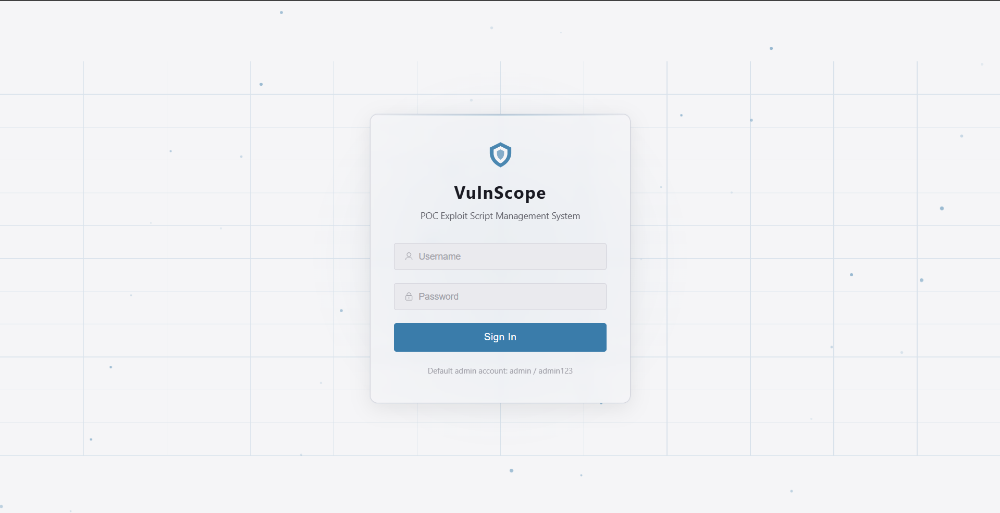</p>

<p align="center">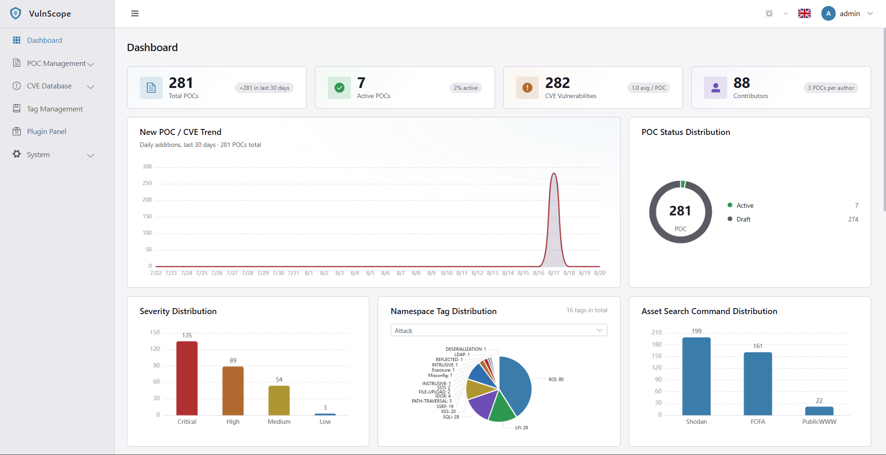</p>

<p align="center">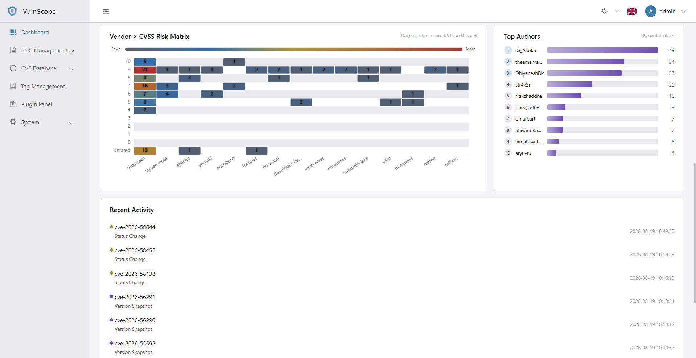</p>

### POC Management

<p align="center">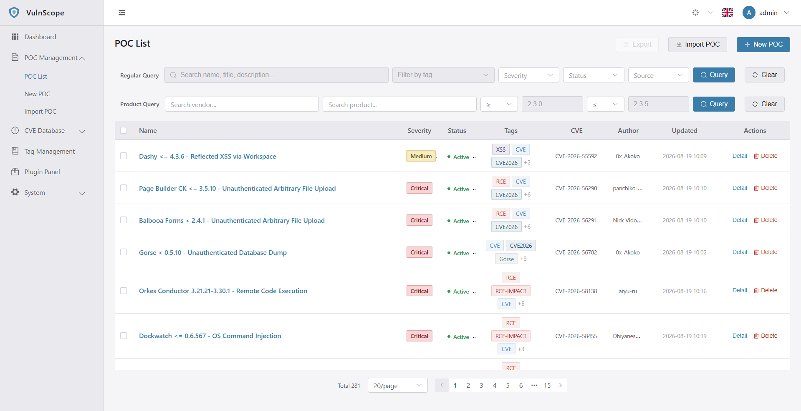</p>

<p align="center">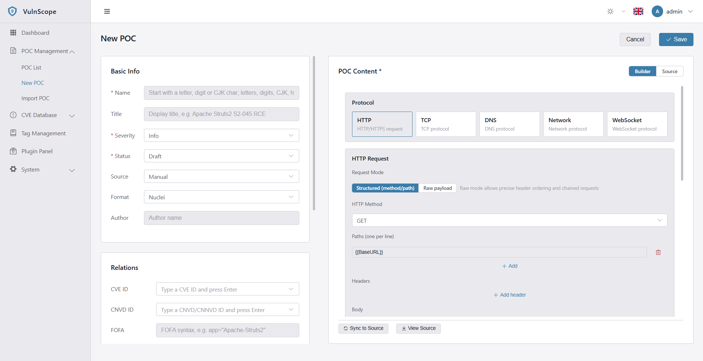</p>

<p align="center">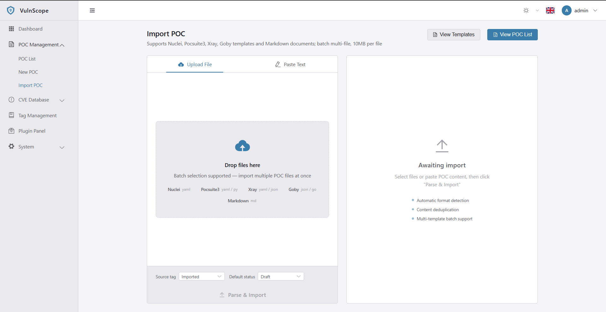</p>

### CVE Database

<p align="center">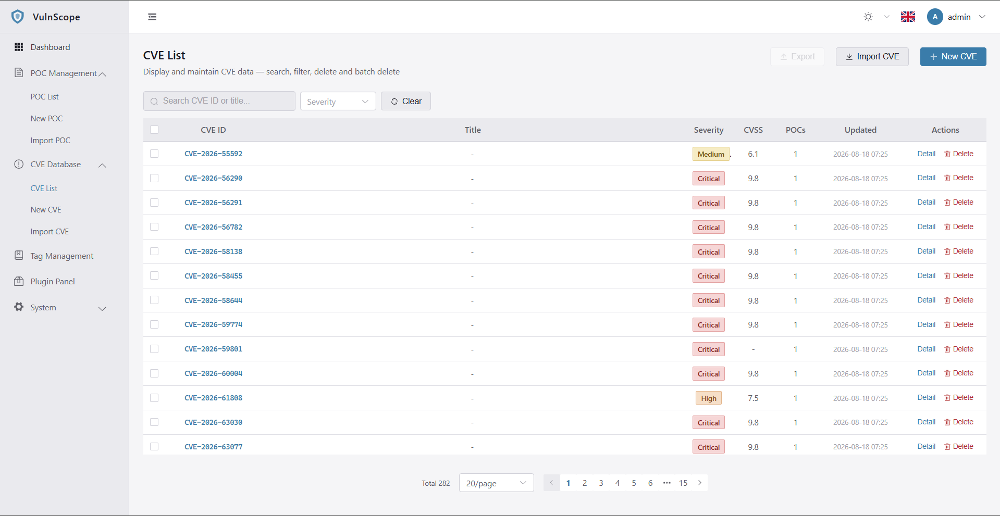</p>

<p align="center">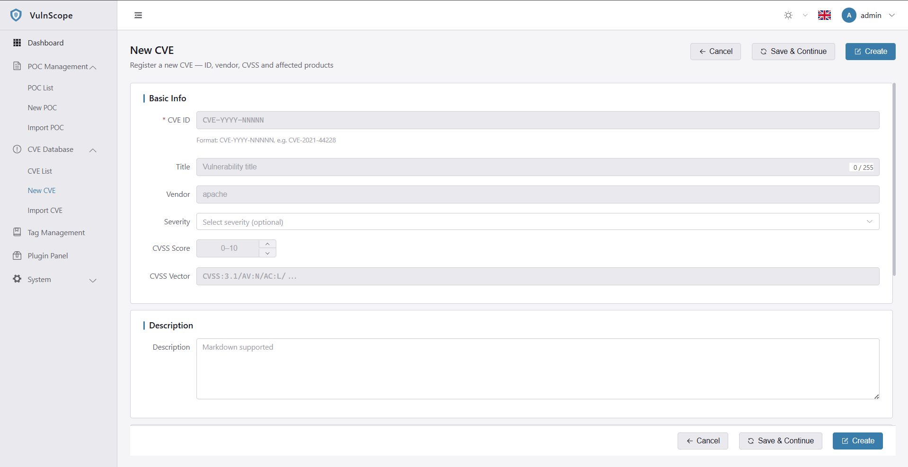</p>

<p align="center">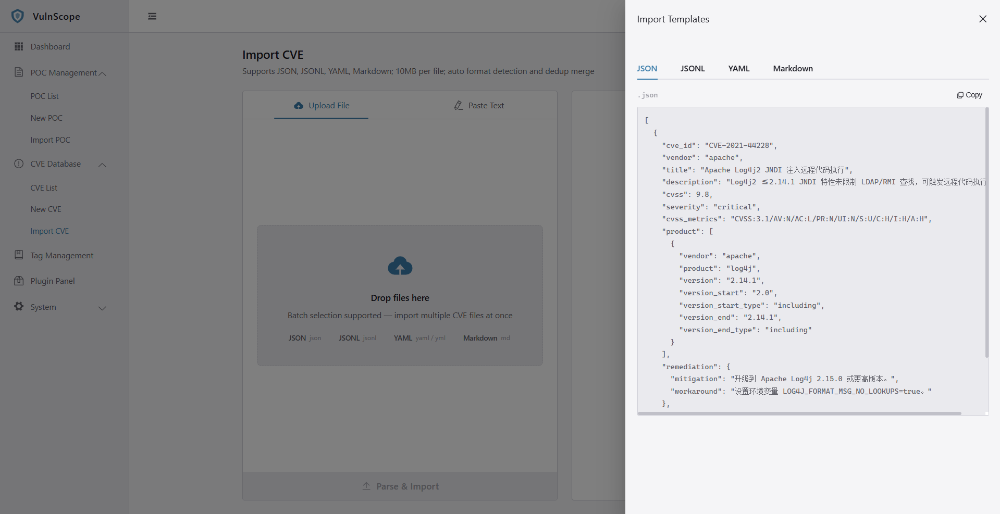</p>

### Tags / Plugins / Audit Logs / Profile

<p align="center">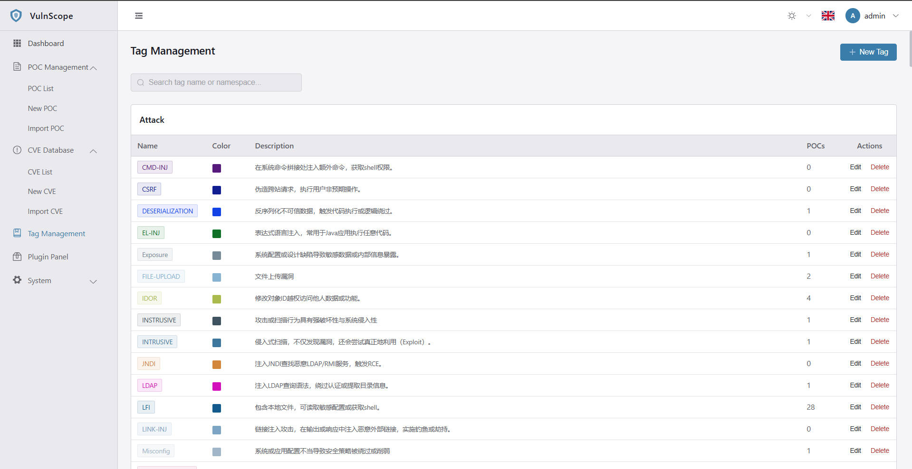</p>

<p align="center">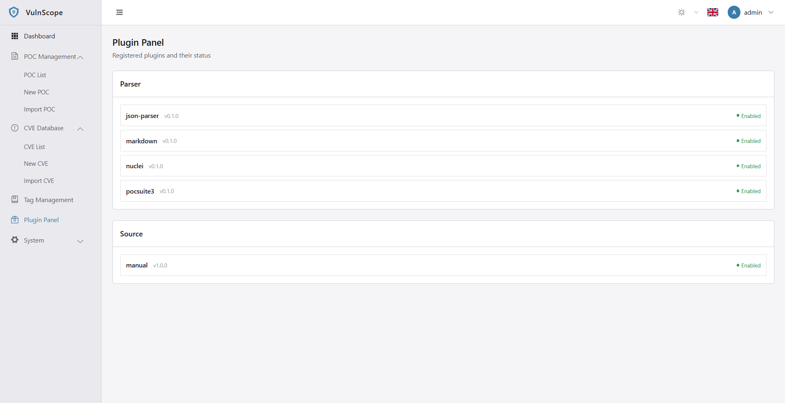</p>

<p align="center">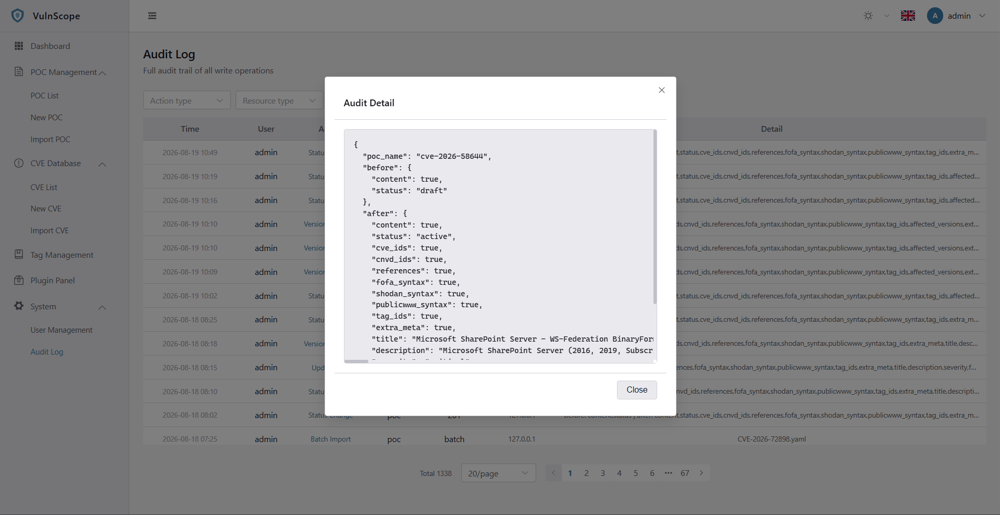</p>

<p align="center">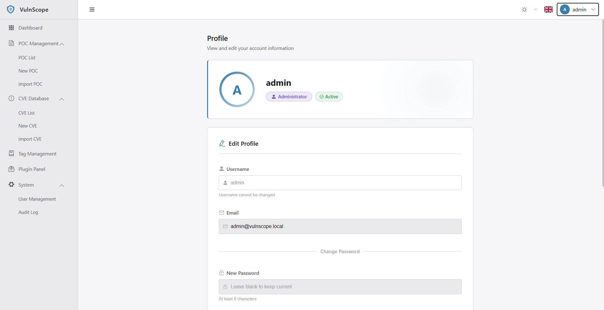</p>

## Quick Start

### Prerequisites

- Python 3.10+
- Node.js 18+
- Optional: MySQL 8.0 (production)

### Environment Configuration

Before starting the backend, copy `.env.example` to `.env`:

```bash
# Local development: copy to backend directory
cp .env.example backend/.env

# Docker deployment: copy to project root (read by docker compose)
cp .env.example .env
```

Key environment variables:

| Variable | Default | Description |
|----------|---------|-------------|
| `VULNSCOPE_SECRET_KEY` | `change-me-...` | JWT signing key, generate with `openssl rand -hex 32` |
| `VULNSCOPE_ADMIN_PASSWORD` | `change-me-...` | Default admin password |
| `VULNSCOPE_ADMIN_USERNAME` | `admin` | Default admin username |
| `VULNSCOPE_ADMIN_EMAIL` | `admin@vulnscope.local` | Default admin email |
| `VULNSCOPE_APP_ENV` | `dev` | Runtime environment (dev / prod); prod triggers startup security validation |
| `VULNSCOPE_DB_BACKEND` | `sqlite` | Database backend (sqlite / mysql) |
| `VULNSCOPE_LOG_LEVEL` | `INFO` | Log level (DEBUG / INFO / WARNING / ERROR) |
| `VULNSCOPE_LOGIN_RATE_LIMIT_ENABLED` | `true` | Login rate limiting switch |

> The full set of options is defined in `backend/app/core/config.py`; every variable uses the `VULNSCOPE_` prefix. In production, `docker compose` enforces `${VULNSCOPE_SECRET_KEY:?}` and refuses to start if missing.

### Backend

```bash
# Enter backend directory
cd backend

# Create virtual environment and install dependencies
python -m venv .venv
.venv/Scripts/pip install -e ".[dev]"

# One-click start (auto-detects venv, initializes DB on first run)
start.bat

# Or specify port, skip DB initialization
start.bat --port 8080 --no-migrate
```

> `start.bat` is for Windows, `start.sh` is for Git Bash / Linux. The startup script auto-detects the virtual environment, initializes the database schema on first run, then starts the dev server with `--reload`.

> **Database initialization**: This project does **not** use Alembic migrations. The ORM models (`backend/app/models/`) are the single source of truth for the schema.
> - `python -m app.db.init_db` only runs `Base.metadata.create_all` to create any missing tables — **it writes no seed data**. Use `--reset` to drop and recreate everything (**destroys data**, used to rebuild the dev DB after model/field changes).
> - Built-in roles (viewer/editor/admin) and the default admin (`admin` / `admin123`, configurable via `.env`) are written by the app `lifespan` on startup, not by the `init_db` command.
> - Note: `create_all` only creates tables that do not yet exist; it will not add columns to existing tables. After a field change, use `--reset` or delete `vulnscope.db` and restart.

### Frontend

```bash
# Enter frontend directory
cd frontend

# Install dependencies
npm install

# Start development server
npm run dev
```

### Docker Deployment (Production)

The repo ships a production-grade `docker-compose.yml` with a two-image setup. Both images are based on the self-built `vulnscope` image (ultimately tracing to `python:3.10-slim`); no nginx / node runtime image is pulled:

- **`vulnscope:latest` (backend)** — built from `backend/Dockerfile`, runtime dependencies only, runs as non-root user `app`, with a built-in healthcheck; serves the API on container port 8000 (not exposed externally).
- **`vulnscope-frontend:latest` (frontend edge)** — `FROM vulnscope:latest`, bundles the host-prebuilt static `dist`, runs a lightweight Starlette + httpx edge service: serves the SPA (history-mode fallback) and reverse-proxies `/api/*` to the backend. Exposes port 80 as the single entry point.

#### Deploy steps

```bash
# 1. Configure environment variables in the project root (required)
cp .env.example .env
#    Edit .env and fill in:
#    VULNSCOPE_SECRET_KEY=<random key from: openssl rand -hex 32>
#    VULNSCOPE_ADMIN_PASSWORD=<strong password>

# 2. Build frontend static assets on the host (the frontend image COPYs this dist)
cd frontend
npm install
npm run build          # outputs to frontend/dist
cd ..

# 3. Build and start the full stack
docker compose up -d --build
```

> The frontend Dockerfile does `COPY dist /app/dist`, so step 2 (`npm run build`) must run before image build.
> To change the base Python version, update the site-packages path in both `backend/Dockerfile` and `frontend/Dockerfile`.

#### Architecture & persistence

```
Browser ──http://localhost:80──> vulnscope-frontend (Starlette edge)
                                     │  SPA static + history fallback
                                     │  /api/* reverse proxy (X-Forwarded-For passthrough)
                                     ▼
                               vulnscope-backend (FastAPI, container port 8000)
                                     │
                                     ▼
                          vulnscope-data volume → /app/data/vulnscope.db
```

- **Data persistence**: the SQLite database file lives on the named volume `vulnscope-data`, mounted at the container's standalone `/app/data` directory, fully separated from the application code baked into the image. Deleting or recreating containers does not lose data; upgrading the image does not lose data.
- **Minimal exposure**: the backend port 8000 is not published; only the frontend edge service proxies to it over the container network. Port 80 is the sole external entry point.
- **Non-root**: the backend runs as user `app (uid=999)`; the data directory is owned by `app`.
- **Real client IP**: the frontend edge passes `X-Forwarded-For`; the backend `netutil.get_client_ip` parses the XFF chain to identify the real origin for rate limiting and auditing.

#### Production variable validation

`docker-compose.yml` uses `${VULNSCOPE_SECRET_KEY:?...}` and `${VULNSCOPE_ADMIN_PASSWORD:?...}` to enforce injection: `docker compose` errors out if these are absent from `.env`. On startup, `Settings.validate_security()` further checks that under `APP_ENV=prod` the `SECRET_KEY` is not the default value and is at least 32 bytes, aborting otherwise.

#### Operations

```bash
docker compose ps                       # service status
docker compose logs -f backend          # tail backend logs
docker compose logs -f frontend          # tail frontend logs
docker compose restart backend          # restart backend (in-process rate-limit counters reset)
docker compose down                     # stop & remove containers (keeps volume)
docker compose down -v                  # stop & remove containers and volume (clears data)
```

### Access URLs

| URL | Description |
|-----|-------------|
| http://localhost | Frontend admin panel (Docker deployment entry, port 80) |
| http://localhost:5173 | Frontend dev server (dev mode `npm run dev` only) |
| http://localhost:8000/docs | Swagger UI interactive docs (backend local dev) |
| http://localhost:8000/api/v1/health | Health check |

### Default Admin Account

| Username | Password | Role |
|----------|----------|------|
| `admin` | `admin123` | admin |

## Project Structure

```
VulnScope/
├── backend/                  # FastAPI backend
│   ├── app/
│   │   ├── main.py           # App entry + lifecycle + startup security validation
│   │   ├── core/             # Config / exceptions / security / events / cache / ratelimit / net
│   │   │   ├── config.py     # Layered config + prod SECRET_KEY validation
│   │   │   ├── exceptions.py  # Unified exceptions (rate-limit error code + header passthrough)
│   │   │   ├── ratelimit/    # Rate-limit framework (storage / fixed-window / limiter facade)
│   │   │   ├── netutil.py    # Client IP extraction (parses X-Forwarded-For)
│   │   │   ├── security.py   # JWT / password hashing / RBAC
│   │   │   ├── events.py     # Event bus
│   │   │   └── cache.py      # Cache backend abstraction (inproc / redis)
│   │   ├── db/               # Session management / base classes / init (init_db.py)
│   │   ├── models/           # ORM models (single source of truth for schema)
│   │   ├── schemas/          # Pydantic request/response schemas
│   │   ├── api/v1/           # REST API routes
│   │   ├── services/         # Business logic (auth_service wires login rate limiting)
│   │   └── plugins/          # Plugin framework
│   ├── tests/                # pytest test suite (incl. rate-limit tests)
│   ├── Dockerfile            # Backend image (non-root + healthcheck)
│   ├── .dockerignore
│   ├── start.bat / start.sh  # Startup scripts
│   └── pyproject.toml        # Dependencies + tooling config
├── frontend/                 # Vue 3 frontend
│   ├── src/
│   │   ├── views/            # Page components
│   │   ├── components/       # Shared components
│   │   ├── composables/      # Composition functions
│   │   ├── api/              # API client
│   │   ├── stores/           # State management
│   │   ├── router/           # Routing
│   │   └── styles/           # Global styles
│   ├── edge_server.py        # Frontend edge service (SPA hosting + /api reverse proxy)
│   ├── Dockerfile            # Frontend image (FROM vulnscope)
│   ├── nginx.conf            # Nginx config (optional nginx hosting, fallback)
│   └── .dockerignore
├── templates/                # Import/reference templates
│   ├── cve/                  # CVE import templates (json/jsonl/yaml/markdown)
│   └── poc/                  # POC template (nuclei-template.yaml)
├── docs/                     # Documentation + usage guide
├── .env.example              # Deployment env template (read by compose)
└── docker-compose.yml        # Full-stack production orchestration
```

## API Overview

| Method | Path | Description | Auth |
|--------|------|-------------|------|
| POST | `/api/v1/auth/login` | Login | None |
| POST | `/api/v1/auth/refresh` | Refresh token | None |
| GET | `/api/v1/auth/me` | Current user | Required |
| PUT | `/api/v1/auth/profile` | Update own profile | Required |
| GET/POST | `/api/v1/pocs` | List/Create POCs | Required |
| GET | `/api/v1/pocs/search` | Keyword search | Required |
| GET/PUT/DELETE | `/api/v1/pocs/{id}` | POC detail/update/delete | Required |
| PATCH | `/api/v1/pocs/{id}/status` | Status transition | editor/admin |
| POST | `/api/v1/pocs/{id}/clone` | Clone POC | editor/admin |
| GET | `/api/v1/pocs/{id}/versions` | Version history | Required |
| GET | `/api/v1/pocs/{id}/source-records` | Source provenance | Required |
| POST | `/api/v1/pocs/verify-url` | Verify URL | Required |
| POST | `/api/v1/import` | Import POCs | editor/admin |
| GET | `/api/v1/export` | Export POCs | Required |
| GET/POST/PUT/DELETE | `/api/v1/tags` | Tag management | Required |
| GET | `/api/v1/tags/namespaces` | Tag namespaces | Required |
| GET | `/api/v1/vulns` | CVE database | Required |
| GET | `/api/v1/vulns/by-cve/{cve_id}` | Lookup by CVE ID | Required |
| GET | `/api/v1/dashboard/*` | Dashboard stats | Required |
| GET/POST/PUT/DELETE | `/api/v1/users` | User management | admin |
| GET | `/api/v1/users/roles` | Role list | admin |
| GET | `/api/v1/plugins` | Plugin list | Required |
| GET | `/api/v1/plugins/{slot}` | Plugins by slot | Required |
| GET | `/api/v1/audit-logs` | Audit logs | admin |

## Configuration

Configure via environment variables or `.env` file. All variables use the `VULNSCOPE_` prefix:

| Variable | Default | Description |
|----------|---------|-------------|
| `VULNSCOPE_APP_ENV` | `dev` | Runtime environment (dev / test / prod); prod enables startup security validation |
| `VULNSCOPE_DB_BACKEND` | `sqlite` | Database backend (sqlite / mysql) |
| `VULNSCOPE_DATABASE_URL` | generated | Explicit DB URL (takes precedence); Docker sets `sqlite:////app/data/vulnscope.db` |
| `VULNSCOPE_CACHE_BACKEND` | `inproc` | Cache backend (inproc / redis, v2) |
| `VULNSCOPE_SECRET_KEY` | dev key | JWT signing key; prod refuses to start if default or < 32 bytes |
| `VULNSCOPE_ACCESS_TOKEN_EXPIRE_MINUTES` | 30 | Access token TTL |
| `VULNSCOPE_REFRESH_TOKEN_EXPIRE_DAYS` | 7 | Refresh token TTL |
| `VULNSCOPE_SEED_ADMIN_USERNAME` | `admin` | Seed admin username |
| `VULNSCOPE_SEED_ADMIN_PASSWORD` | `admin123` | Seed admin password (override in production) |
| `VULNSCOPE_LOGIN_RATE_LIMIT_ENABLED` | `true` | Login rate-limit switch (per-IP brute-force protection) |
| `VULNSCOPE_LOGIN_RATE_LIMIT_MAX_ATTEMPTS` | `5` | Max login attempts within the window |
| `VULNSCOPE_LOGIN_RATE_LIMIT_WINDOW` | `300` | Rate-limit window duration (seconds) |

> The full set of options is defined in `backend/app/core/config.py`; every variable uses the `VULNSCOPE_` prefix.
> **Production deployment**: `docker-compose.yml` enforces `${VULNSCOPE_SECRET_KEY:?}` and `${VULNSCOPE_ADMIN_PASSWORD:?}` — missing values abort startup. See the root `.env.example`.

## Running Tests

```bash
cd backend
.venv/Scripts/pytest -v                    # Run all tests
.venv/Scripts/pytest --cov=app tests/       # With coverage
```

## Tech Stack

| Layer | Component | Purpose |
|-------|-----------|---------|
| Framework | FastAPI + Uvicorn | Async routing, auto OpenAPI docs |
| ORM | SQLAlchemy 2.0 | Declarative models, init_db.create_all builds all tables (no Alembic) |
| Validation | Pydantic v2 | Request/response models, config validation |
| Auth | bcrypt + PyJWT | Password hashing, dual-token auth |
| Cache | cachetools | In-process TTL cache |
| Frontend | Vue 3 + TypeScript | Composition API |
| UI | Element Plus | Component library |
| Build | Vite | Frontend build tool |

## Detailed Usage Guide

📖 For a complete walkthrough, see the [Usage Guide](docs/usage-guide.md) (Chinese). It covers:

- **Creating a POC** — Basic info, associations, form builder (HTTP/TCP/DNS protocols), matcher rules, source mode
- **Tag Management** — Namespace system, create/edit/delete tags, best practices
- **Import/Export** — Batch file upload, paste text, auto format detection
- **FAQ** — Name conflicts, format limitations, version rollback, content deduplication

## Development Milestones

- ✅ **M1 Skeleton** — Project scaffolding, config, auth, exceptions, plugin interfaces
- ✅ **M2 Core Storage** — POC CRUD, tags/categories, CVE association, search
- ✅ **M3 Plugin Framework** — Registry, event bus, Parser/Source slots
- ✅ **M4 Import/Export** — Import wizard, format detection, dedup, export
- ✅ **M5 Frontend** — Complete admin UI
- ✅ **M6 Deployment** — Full-stack Docker production orchestration (two images + edge service + volume persistence + startup security validation)
- ⏳ **M7 Polish** — Benchmarking, performance optimization
- ⏳ **v2 Verification** — Remote POC execution
- ⏳ **v2 AI Generation** — POC auto-generation from vulnerability descriptions
- ⏳ **v2 Crawler** — Automated POC crawling

## License

MIT