<div align="center">
  <h1>VulnScope</h1>
  <p><strong>POC（Proof of Concept）漏洞验证脚本管理系统</strong></p>
  <p>以 POC 为核心资产，提供管理、存储、检索、导入导出、标签分类、CVE 关联能力</p>
</div>

<p align="center">
  
  
  
  
  
</p>

<p align="center">
  <a href="README.en.md">English</a> | <b>中文</b>
</p>

---

## 特性

- **POC 全生命周期管理** — 创建、编辑、版本回溯、克隆、状态流转
- **多格式支持** — Nuclei YAML、Pocsuite3、JSON、原始脚本，格式无关架构
- **批量导入导出** — 自动格式嗅探、内容去重、批量多文件支持
- **标签分类系统** — 命名空间标签 + 树形分类，灵活组织 POC 资产
- **CVE 漏洞库** — CVE 详情、编辑、新建、批量导入（JSON/JSONL/YAML/Markdown），POC 导入自动同步 CVE 元数据，漏洞与 POC 双向检索
- **统计看板** — 严重级别/状态/来源分布、创建趋势、热门标签、高产作者
- **RBAC 权限** — 三角色（查看者/编辑者/管理员），颗粒度操作控制
- **审计日志** — 所有写操作全量留痕，操作前后摘要 + IP 记录
- **登录限流** — 按 IP 固定窗口限流防爆破，超限返回 429 + `Retry-After`，登录成功自动清零
- **生产安全加固** — 生产环境强制随机 `SECRET_KEY` 启动校验，部署变量缺失即拒绝启动
- **插件框架** — Parser/Source/Verifier/Exporter 四插槽，即插即用
- **事件驱动架构** — 领域事件异步派发，模块间解耦联动

## 界面预览

### 登录与统计看板

<p align="center">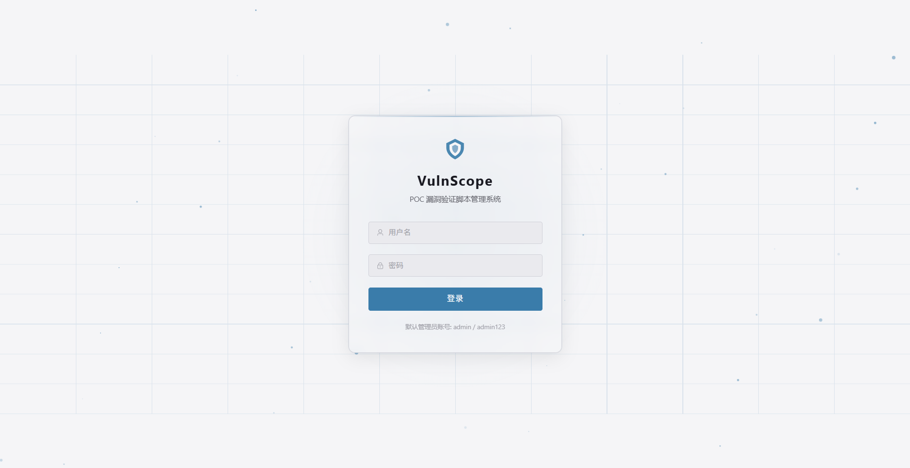</p>

<p align="center">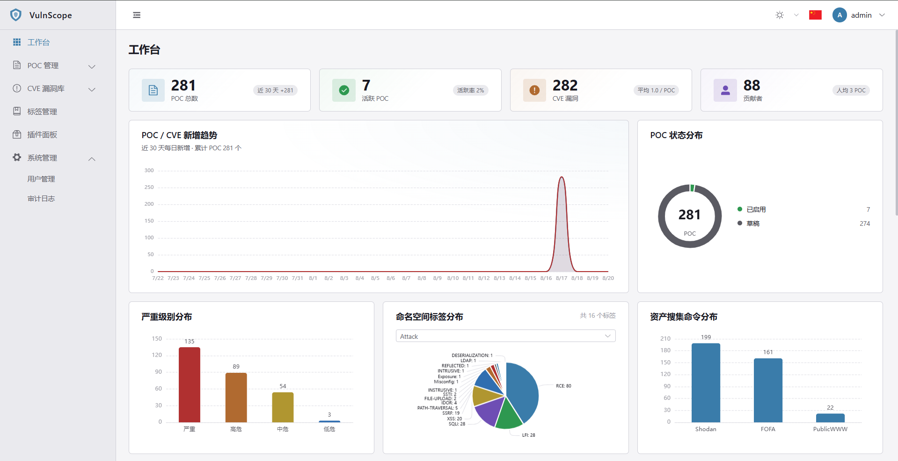</p>

<p align="center">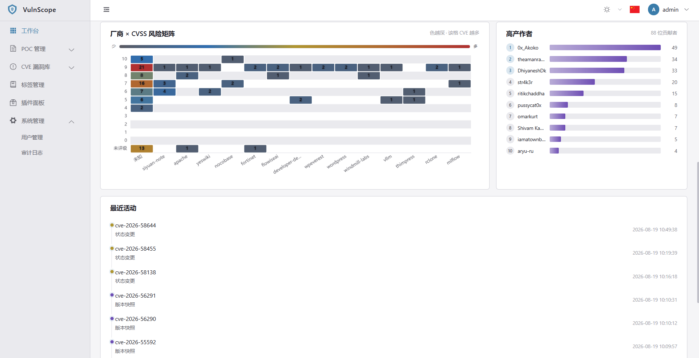</p>

### POC 管理

<p align="center">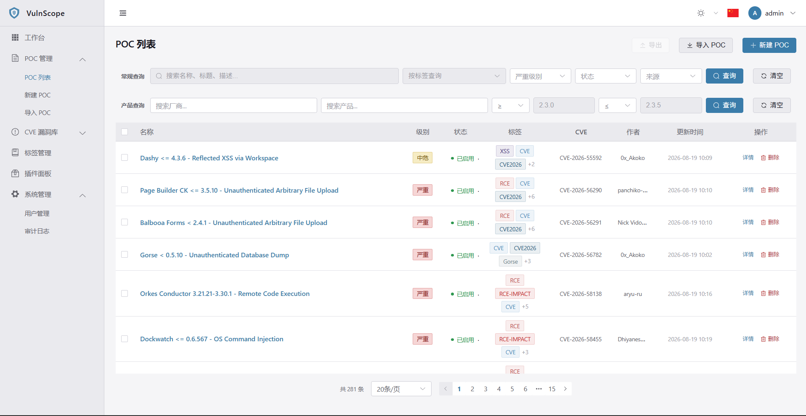</p>

<p align="center">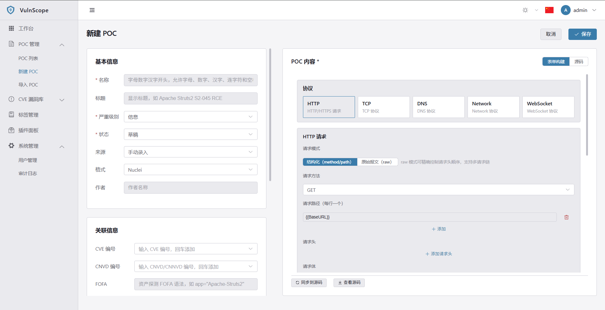</p>

<p align="center">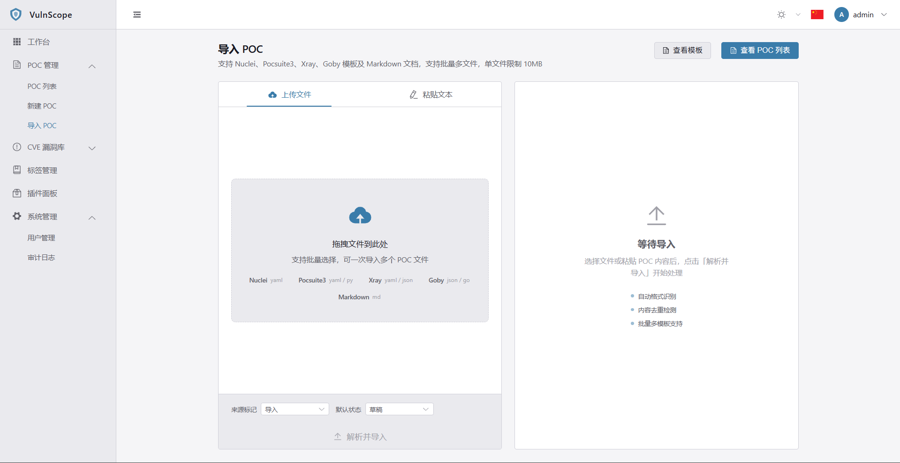</p>

### CVE 漏洞库

<p align="center">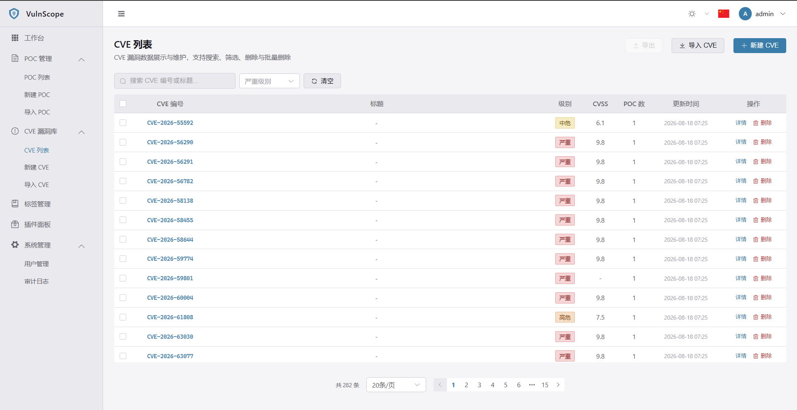</p>

<p align="center">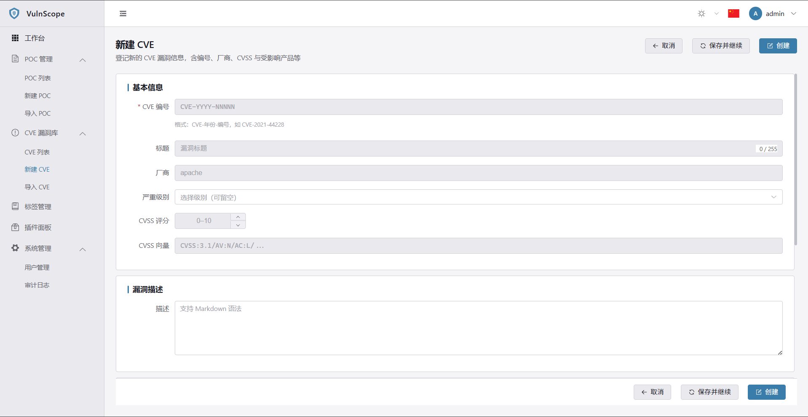</p>

<p align="center">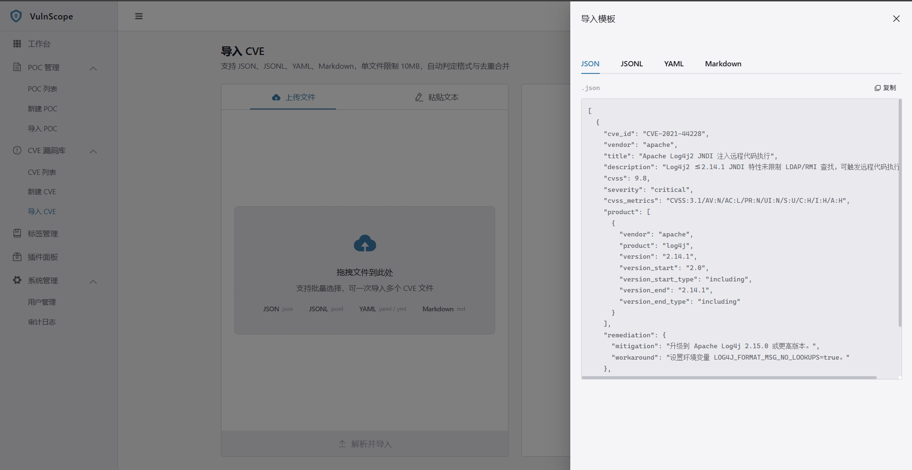</p>

### 标签 / 插件 / 审计 / 个人中心

<p align="center">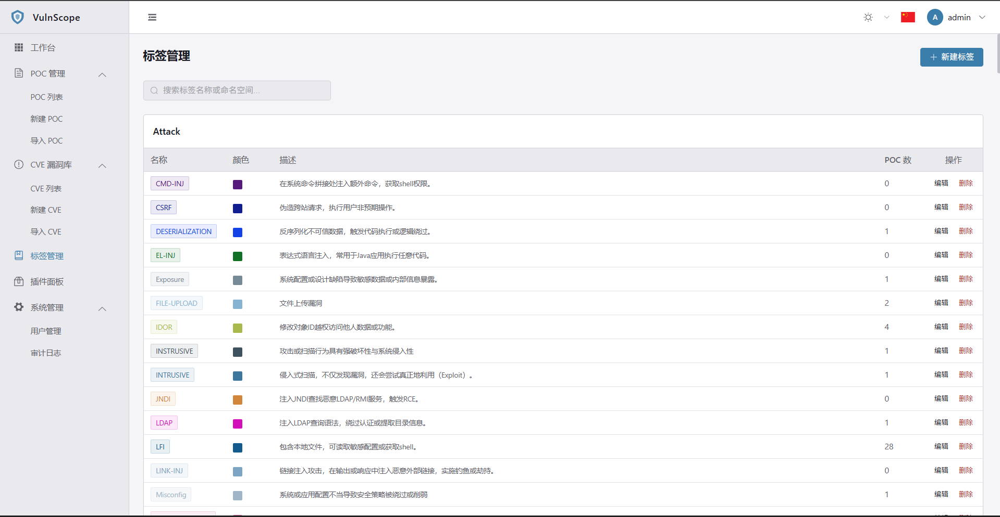</p>

<p align="center">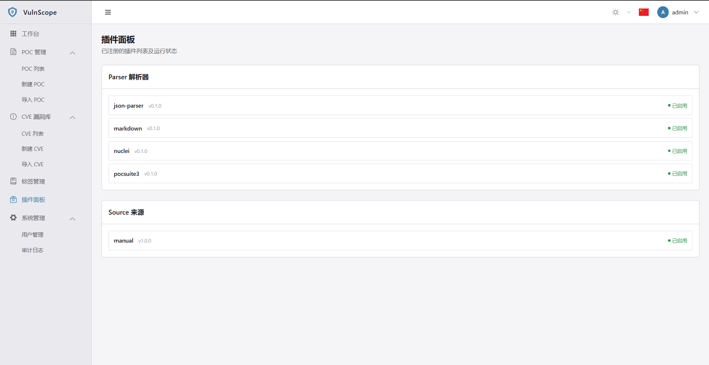</p>

<p align="center">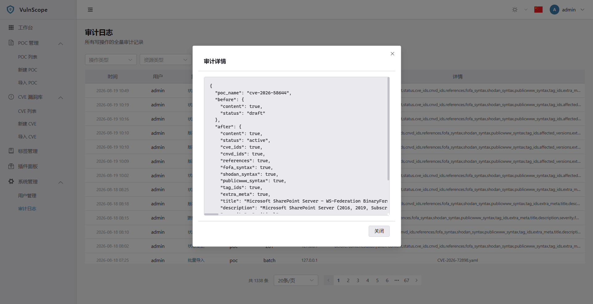</p>

<p align="center">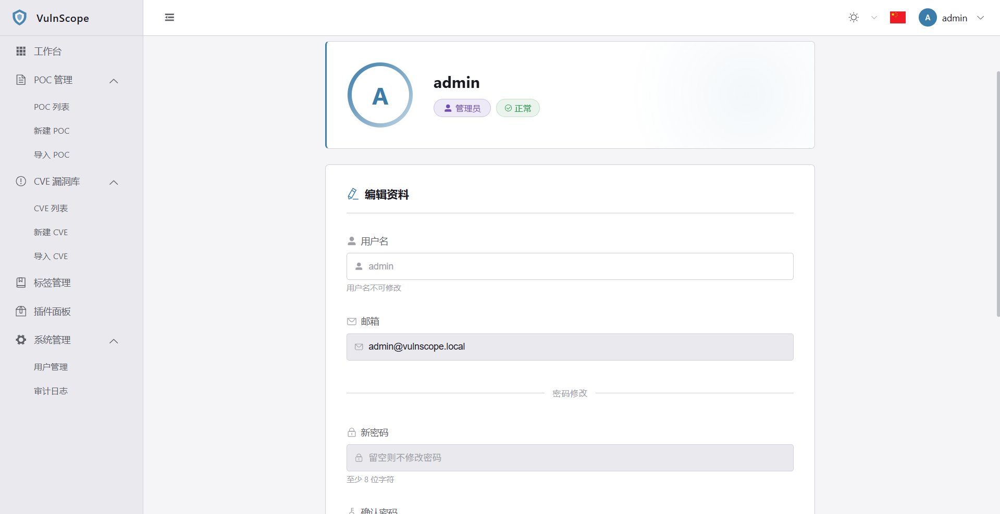</p>

## 快速开始

### 前置要求

- Python 3.10+
- Node.js 18+
- 可选：MySQL 8.0（生产环境）

### 环境配置

后端启动前需要将 `.env.example` 复制为 `.env`：

```bash
# 本地开发：后端环境配置
cd backend

cp .env.example .env

# 创建虚拟环境并安装依赖
python -m venv .venv
.venv/Scripts/pip install -e ".[dev]"
```

关键环境变量说明：

| 变量 | 默认值 | 说明 |
|------|--------|------|
| `VULNSCOPE_SECRET_KEY` | `change-me-...` | JWT 签名密钥，生产环境务必改为随机值（`openssl rand -hex 32`） |
| `VULNSCOPE_ADMIN_PASSWORD` | `change-me-...` | 默认管理员密码，生产环境务必修改 |
| `VULNSCOPE_ADMIN_USERNAME` | `admin` | 默认管理员用户名 |
| `VULNSCOPE_ADMIN_EMAIL` | `admin@vulnscope.local` | 默认管理员邮箱 |
| `VULNSCOPE_APP_ENV` | `dev` | 运行环境（dev / prod）；prod 触发安全启动校验 |
| `VULNSCOPE_DB_BACKEND` | `sqlite` | 数据库后端（sqlite / mysql） |
| `VULNSCOPE_LOG_LEVEL` | `INFO` | 日志级别（DEBUG / INFO / WARNING / ERROR） |
| `VULNSCOPE_LOGIN_RATE_LIMIT_ENABLED` | `true` | 登录限流开关 |

> 完整配置项以 `backend/app/core/config.py` 为准，所有变量均带 `VULNSCOPE_` 前缀。生产部署时 `docker compose` 通过 `${VULNSCOPE_SECRET_KEY:?}` 强制注入，缺失即拒绝启动。

### 后端启动

```bash
# 进入后端目录
cd backend

# 一键启动（自动检测虚拟环境、首次运行自动初始化数据库）
start.bat

# 或指定端口、跳过数据库初始化
start.bat --port 8080 --no-migrate
```

> `start.bat` 适用于 Windows，`start.sh` 适用于 Git Bash / Linux。启动脚本会自动检查虚拟环境、首次运行时自动初始化数据库表结构，然后启动开发服务器（`--reload`）。

> **数据库初始化**：本项目不使用 Alembic 迁移，ORM 模型（`backend/app/models/`）是表结构的唯一真相。
> - `python -m app.db.init_db` 仅按模型元数据 `create_all` 建全部缺失表（**不写任何种子数据**）；`--reset` 清空重建（**会丢数据**，用于模型字段变更后重建开发库）。
> - 内置角色（viewer/editor/admin）与默认管理员（`admin` / `admin123`，可经 `.env` 配置）由应用启动 `lifespan` 按需写入，不在 `init_db` 命令产出。
> - 注意 `create_all` 只建不存在的表、不会给已有表补列；字段变更后请用 `--reset` 或删除 `vulnscope.db` 后重启。

### 前端启动

```bash
# 进入前端目录
cd frontend

# 安装依赖
npm install

# 启动开发服务器
npm run dev
```

### Docker 部署（生产）

仓库自带生产级 `docker-compose.yml`，采用双镜像编排，两个镜像均基于自建 `vulnscope` 镜像（最终追溯到 `python:3.10-slim`），不引入 nginx / node 运行时镜像：

- **`vulnscope:latest`（后端）** — 由 `backend/Dockerfile` 构建，仅含运行时依赖，以非 root 用户 `app` 运行，内置 healthcheck，提供 API（容器内 8000，不对外暴露）。
- **`vulnscope-frontend:latest`（前端边缘服务）** — `FROM vulnscope:latest`，内置宿主机预编译的前端静态产物 `dist`，运行基于 Starlette + httpx 的轻量边缘服务：托管 SPA（history 模式 fallback）+ 反向代理 `/api/*` 到后端。对外暴露 80 端口，作为统一入口。

#### 部署步骤

```bash
# 1. 在项目根目录配置环境变量（必须）
cp .env.example .env
#    编辑 .env，填入：
#    VULNSCOPE_SECRET_KEY=<openssl rand -hex 32 生成的随机密钥>
#    VULNSCOPE_ADMIN_PASSWORD=<强密码>

# 2. 在宿主机编译前端静态产物（前端镜像构建时 COPY 此 dist）
cd frontend
npm install
npm run build          # 产物输出到 frontend/dist
cd ..

# 3. 构建并启动全栈
docker compose up -d --build
```

> 前端镜像 `COPY dist /app/dist`，因此步骤 2 的 `npm run build` 必须先于镜像构建执行。
> 若需更换基础镜像 Python 版本，同步修改 `backend/Dockerfile` 与 `frontend/Dockerfile` 中的 site-packages 路径。

#### 架构与持久化

```
浏览器 ──http://localhost:80──> vulnscope-frontend (Starlette 边缘服务)
                                     │  SPA 静态托管 + history fallback
                                     │  /api/* 反代（透传 X-Forwarded-For）
                                     ▼
                               vulnscope-backend (FastAPI, 容器内 8000)
                                     │
                                     ▼
                          vulnscope-data 卷 → /app/data/vulnscope.db
```

- **数据持久化**：SQLite 数据库文件落于命名卷 `vulnscope-data`，挂载到容器内独立目录 `/app/data`，与镜像内应用代码彻底分离。删除或重建容器不丢数据，升级镜像不丢数据。
- **最小暴露面**：后端 8000 端口不对外发布，仅由前端边缘服务在容器网络内反向代理访问；对外仅暴露前端 80 端口。
- **非 root 运行**：后端以 `app(uid=999)` 用户运行，数据目录归属 `app`。
- **真实客户端 IP**：前端边缘服务透传 `X-Forwarded-For`，后端 `netutil.get_client_ip` 解析 XFF 链识别真实来源，供登录限流与审计使用。

#### 生产环境变量校验

`docker-compose.yml` 用 `${VULNSCOPE_SECRET_KEY:?...}` 与 `${VULNSCOPE_ADMIN_PASSWORD:?...}` 强制注入：未在 `.env` 中配置时 `docker compose` 直接报错拒绝启动。应用启动时 `Settings.validate_security()` 进一步校验：`APP_ENV=prod` 下 `SECRET_KEY` 为默认值或长度不足 32 字节则抛错退出。

#### 运维命令

```bash
docker compose ps                       # 查看服务状态
docker compose logs -f backend          # 跟随后端日志
docker compose logs -f frontend         # 跟随前端日志
docker compose restart backend          # 重启后端（进程内限流计数随之重置）
docker compose down                     # 停止并删除容器（保留数据卷）
docker compose down -v                  # 停止并删除容器与数据卷（清空数据）
```

### 访问地址

| 地址 | 说明 |
|------|------|
| http://localhost | 前端管理后台（Docker 部署统一入口，80 端口） |
| http://localhost:5173 | 前端开发服务器（仅开发模式 `npm run dev`） |
| http://localhost:8000/docs | Swagger UI 交互文档（后端本地开发） |
| http://localhost:8000/api/v1/health | 健康检查 |

### 默认管理员账号

| 用户名 | 密码 | 角色 |
|--------|------|------|
| `admin` | `admin123` | admin |

## 项目结构

```
VulnScope/
├── backend/                  # FastAPI 后端
│   ├── app/
│   │   ├── main.py           # 应用入口 + 生命周期 + 安全启动校验
│   │   ├── core/             # 配置 / 异常 / 安全 / 事件 / 缓存 / 限流 / 网络
│   │   │   ├── config.py     # 分层配置 + 生产 SECRET_KEY 校验
│   │   │   ├── exceptions.py  # 统一异常体系（含限流错误码 + 响应头透传）
│   │   │   ├── ratelimit/    # 限流框架（存储抽象 / 固定窗口 / 限流器门面）
│   │   │   ├── netutil.py    # 客户端 IP 提取（解析 X-Forwarded-For）
│   │   │   ├── security.py   # JWT / 密码哈希 / RBAC
│   │   │   ├── events.py     # 事件总线
│   │   │   └── cache.py      # 缓存后端抽象（inproc / redis）
│   │   ├── db/               # 会话管理 / 基类 / 初始化（init_db.py）
│   │   ├── models/           # ORM 模型（表结构唯一真相）
│   │   ├── schemas/          # Pydantic 请求/响应
│   │   ├── api/v1/           # REST 路由
│   │   ├── services/         # 业务服务层（auth_service 内含登录限流接入）
│   │   └── plugins/          # 插件框架
│   ├── tests/                # pytest 测试（含限流用例）
│   ├── Dockerfile            # 后端镜像（非 root + healthcheck）
│   ├── .dockerignore
│   ├── start.bat / start.sh  # 启动脚本
│   └── pyproject.toml        # 依赖 + 工具配置
├── frontend/                 # Vue 3 前端
│   ├── src/
│   │   ├── views/            # 页面
│   │   ├── components/       # 组件
│   │   ├── composables/      # 组合式函数
│   │   ├── api/              # API 客户端
│   │   ├── stores/           # 状态管理
│   │   ├── router/           # 路由
│   │   └── styles/           # 全局样式
│   ├── edge_server.py        # 前端边缘服务（SPA 托管 + /api 反代）
│   ├── Dockerfile            # 前端镜像（FROM vulnscope）
│   ├── nginx.conf            # Nginx 配置（可选 nginx 托管方案，备用）
│   └── .dockerignore
├── templates/                # 导入/参考模板
│   ├── cve/                  # CVE 导入模板（json/jsonl/yaml/markdown）
│   └── poc/                  # POC 模板（nuclei-template.yaml）
├── docs/                     # 开发文档 + 使用说明书
├── .env.example              # 部署环境变量模板（compose 读取）
└── docker-compose.yml        # 全栈生产编排
```

## API 概览

| 方法 | 路径 | 说明 | 鉴权 |
|------|------|------|------|
| POST | `/api/v1/auth/login` | 登录 | 无需 |
| POST | `/api/v1/auth/refresh` | 刷新 Token | 无需 |
| GET | `/api/v1/auth/me` | 当前用户 | 需认证 |
| PUT | `/api/v1/auth/profile` | 更新个人资料 | 需认证 |
| GET/POST | `/api/v1/pocs` | POC 列表/创建 | 需认证 |
| GET | `/api/v1/pocs/search` | 关键字搜索 | 需认证 |
| GET/PUT/DELETE | `/api/v1/pocs/{id}` | POC 详情/更新/删除 | 需认证 |
| PATCH | `/api/v1/pocs/{id}/status` | 状态流转 | editor/admin |
| POST | `/api/v1/pocs/{id}/clone` | 克隆 POC | editor/admin |
| GET | `/api/v1/pocs/{id}/versions` | 版本历史 | 需认证 |
| GET | `/api/v1/pocs/{id}/source-records` | 来源溯源 | 需认证 |
| POST | `/api/v1/pocs/verify-url` | 验证 URL | 需认证 |
| POST | `/api/v1/import` | 导入 POC | editor/admin |
| GET | `/api/v1/export` | 导出 POC | 需认证 |
| GET/POST/PUT/DELETE | `/api/v1/tags` | 标签管理 | 需认证 |
| GET | `/api/v1/tags/namespaces` | 标签命名空间 | 需认证 |
| GET | `/api/v1/vulns` | CVE 列表（分页/筛选/搜索） | 需认证 |
| GET/POST | `/api/v1/vulns` / `/api/v1/vulns/{id}` | CVE 查询 / 创建 / 详情 / 更新 | 需认证（写操作 editor/admin） |
| GET | `/api/v1/vulns/by-cve/{cve_id}` | 按 CVE 编号查询 | 需认证 |
| POST | `/api/v1/vulns/import` | 批量导入 CVE（json/jsonl/yaml/markdown） | editor/admin |
| DELETE | `/api/v1/vulns/{id}` | 删除单个/批量 CVE | editor/admin |
| GET | `/api/v1/dashboard/*` | 统计看板 | 需认证 |
| GET/POST/PUT/DELETE | `/api/v1/users` | 用户管理 | admin |
| GET | `/api/v1/users/roles` | 角色列表 | admin |
| GET | `/api/v1/plugins` | 插件列表 | 需认证 |
| GET | `/api/v1/plugins/{slot}` | 按槽位查插件 | 需认证 |
| GET | `/api/v1/audit-logs` | 审计日志 | admin |

## 配置

通过环境变量或 `.env` 文件配置，前缀 `VULNSCOPE_`：

| 变量 | 默认值 | 说明 |
|------|--------|------|
| `VULNSCOPE_APP_ENV` | `dev` | 运行环境（dev / test / prod）；prod 触发安全启动校验 |
| `VULNSCOPE_DB_BACKEND` | `sqlite` | 数据库后端（sqlite / mysql） |
| `VULNSCOPE_DATABASE_URL` | 按后端生成 | 显式数据库连接 URL（优先级最高）；Docker 部署设为 `sqlite:////app/data/vulnscope.db` |
| `VULNSCOPE_CACHE_BACKEND` | `inproc` | 缓存后端（inproc / redis，v2 引入） |
| `VULNSCOPE_SECRET_KEY` | 开发密钥 | JWT 签名密钥；prod 环境为默认值或不足 32 字节时启动拒绝 |
| `VULNSCOPE_ACCESS_TOKEN_EXPIRE_MINUTES` | 30 | access token 过期时间 |
| `VULNSCOPE_REFRESH_TOKEN_EXPIRE_DAYS` | 7 | refresh token 过期时间 |
| `VULNSCOPE_SEED_ADMIN_USERNAME` | `admin` | 种子管理员用户名 |
| `VULNSCOPE_SEED_ADMIN_PASSWORD` | `admin123` | 种子管理员密码（生产环境务必覆盖） |
| `VULNSCOPE_LOGIN_RATE_LIMIT_ENABLED` | `true` | 登录限流开关（按 IP 防爆破） |
| `VULNSCOPE_LOGIN_RATE_LIMIT_MAX_ATTEMPTS` | `5` | 窗口内最大登录尝试次数 |
| `VULNSCOPE_LOGIN_RATE_LIMIT_WINDOW` | `300` | 限流窗口时长（秒） |

> 完整的可配置项以 `backend/app/core/config.py` 为准，所有变量均带 `VULNSCOPE_` 前缀。
> **生产部署**：`docker-compose.yml` 通过 `${VULNSCOPE_SECRET_KEY:?}` 与 `${VULNSCOPE_ADMIN_PASSWORD:?}` 强制注入，缺失即拒绝启动；详见项目根 `.env.example`。

## 运行测试

```bash
cd backend
.venv/Scripts/pytest -v                    # 全部测试
.venv/Scripts/pytest --cov=app tests/       # 带覆盖率
```

## 技术栈

| 层次 | 组件 | 用途 |
|------|------|------|
| 后端框架 | FastAPI + Uvicorn | 异步路由、自动 OpenAPI 文档 |
| ORM | SQLAlchemy 2.0 | 声明式模型，init_db.create_all 建全表（不使用 Alembic） |
| 数据校验 | Pydantic v2 | 请求/响应模型、配置校验 |
| 认证 | bcrypt + PyJWT | 密码哈希、双 token 机制 |
| 缓存 | cachetools | 进程内 TTL 缓存 |
| 前端 | Vue 3 + TypeScript | Composition API |
| UI | Element Plus | 组件库 |
| 构建 | Vite | 前端构建工具 |

## 详细使用说明

📖 完整的使用指南请查阅 [使用说明书](docs/usage-guide.md)，涵盖：

- **新建 POC** — 基本信息填写、关联信息配置、表单构建模式（HTTP/TCP/DNS 协议）、匹配规则配置、源码模式编辑
- **标签管理** — 命名空间体系、新建/编辑/删除标签、最佳实践
- **导入导出** — 批量文件上传、粘贴文本、格式自动识别
- **CVE 漏洞库** — 列表/详情/编辑/新建、批量导入（JSON/JSONL/YAML/Markdown）、POC 导入联动同步
- **常见问题** — 名称冲突、格式限制、版本回滚、内容去重

## 开发里程碑

- ✅ **M1 骨架** — 项目脚手架、配置、鉴权、异常、插件接口
- ✅ **M2 核心存储** — POC CRUD、标签分类、CVE 关联、搜索
- ✅ **M3 插件框架** — 注册表、事件总线、Parser/Source 槽
- ✅ **M4 导入导出** — 导入向导、格式嗅探、去重、导出
- ✅ **M5 前端** — 完整管理后台
- ✅ **M6 部署** — Docker 全栈生产编排（双镜像 + 边缘服务 + 数据卷持久化 + 安全启动校验）
- ⏳ **M7 收尾** — 压测、性能优化
- ⏳ **v2 验证模块** — POC 远程验证执行
- ⏳ **v2 AI 生成** — 基于漏洞描述的 POC 自动生成
- ⏳ **v2 爬取** — 自动化 POC 爬取

## License

MIT